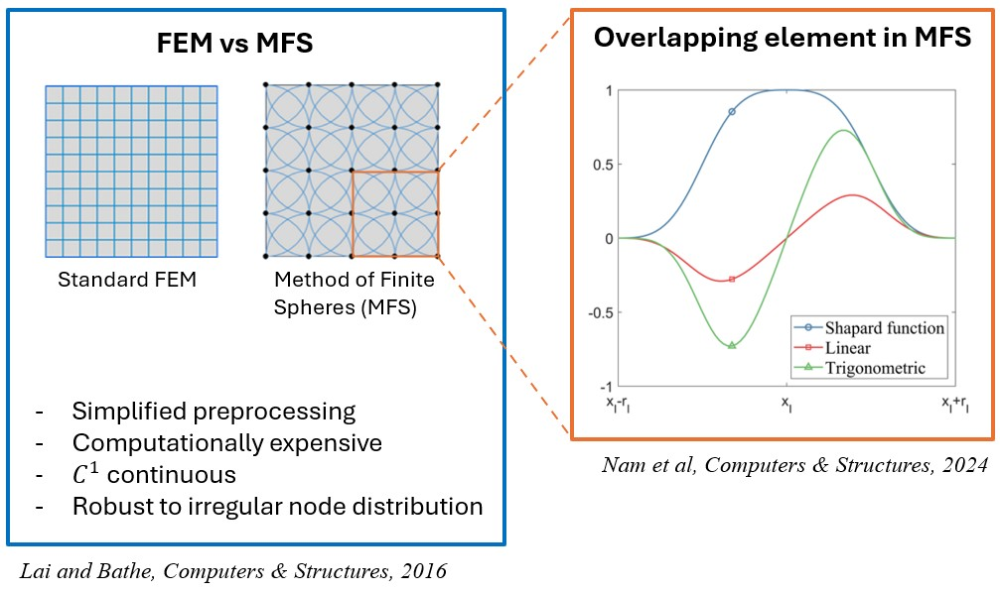
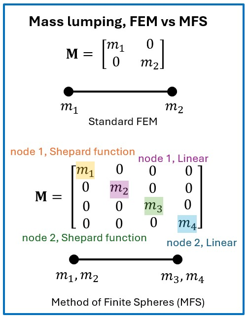

# Hyun-Young Nam

- **Location**: Seoul, South Korea  
- **Email**: hyun_young_nam@brown.edu  

---

## Summary

**PhD student** in Engineering at Brown University (on leave), focusing on the convergence of **Artificial Intelligence** and **Engineering**. 

Experienced in automating finite element simulation workflows. Through developing tools for programmatic model generation, I identified a critical bottleneck in Scientific Machine Learning (SciML): the difficulty of scaling diverse, physically-valid datasets using commercial solvers. Broadly, I aim to advance AI-driven engineering by integrating machine learning with traditional design principles. More specifically, I am focused on developing agentic frameworks-utilizing knowledge graphs and automated review loops-to bridge the gap between high-fidelity FEA and autonomous discovery in Scientific Machine Learning (SciML), including PINNs and Neural Operators.

---

## Skills

- **Programming**: Python, C++, MATLAB
- **Commerical FEM software**: Abaqus, ANSYS Mechanical
- **ML / Scientific computing**: PyTorch, NumPy/SciPy
- **Interests**: Scientific Machine Learning (SciML) - Physics-Informed Learning (PINNs) and Neural Operators (DeepONet); Autonomous Engineering Design via Multi-Agent Systems.

---

## Experience

### Researcher — Stealth Startup  |  2025.02 – 2026.01

- Developing software that automatically generates **editable** simulation inputs for **AI model training**, including **Abaqus `.inp`** files and **ANSYS Mechanical `.dat`** files.
- Constructing **automated pipelines** to scale **diverse, physically-valid dataset generation** by parameterizing geometry, material properties, and boundary conditions for SciML learning

---

## Education

- **Ph.D.**, Brown University — Mechanics of Solids and Structures *(on leave)* (Providence, Rhode Island)  |  2023.09 – present
- **M.S.**, Brown University — Mechanics of Solids (Providence, Rhode Island)  |  2021.09 – 2023.05  
- **B.S.**, Kyungpook National University — Mechanical Engineering (Daegu, South Korea)  |  2015.03 – 2021.08

---

## Projects

### X-PINN for Linear Crack Problems with Enhanced Tip Enrichment

An advanced Extended Physics-Informed Neural Networks (X-PINN) framework for modeling **linear crack problems** in linear elastic materials. This implementation leverages enhanced XFEM-inspired enrichment functions at crack tips combined with state-of-the-art training strategies to accurately capture crack tip stress singularities and displacement discontinuities.

**Key Features**:
- **Enhanced Crack Tip Enrichment**: Sophisticated enrichment elements at crack endpoints for stress concentration modeling
- **Adaptive Residual-based Distribution (RAD)**: Intelligent collocation point sampling that focuses computational effort on high-error regions
- **Two-Stage Optimization**: Adam + L-BFGS for superior convergence (30-40% reduction in global L2 error)
- **Weighted Loss Components**: Balanced PDE, boundary, and initial conditions for improved accuracy
- **Stress Concentration Modeling**: Enhanced von Mises stress computation with crack tip concentration factors

**Framework**: DeepXDE (PyTorch backend)  
**GitHub**: [PINN_Crack_Propagation](https://github.com/hyunyoungnam/PINN_Crack_Propagation)  

---

## Publications

- Nam, H.-Y., "Explicit dynamics with the method of finite spheres using a modified direct inverse mass matrix," *Computers and Structures*, Vol. 295, 2024. `https://doi.org/10.1016/j.compstruc.2024.107296`

### Method of Finite Spheres (MFS) - Key Concepts

**FEM vs MFS Comparison**

*Comparison between Standard Finite Element Method (FEM) and Method of Finite Spheres (MFS), showing overlapping elements in MFS. MFS features simplified preprocessing, C¹ continuity, and robustness to irregular node distribution (Lai and Bathe, Computers & Structures, 2016).*

**Mass Lumping: FEM vs MFS**

*Mass lumping comparison between Standard FEM and Method of Finite Spheres (MFS). The diagram illustrates the diagonal mass matrix structure for both methods, showing how MFS uses multiple basis functions (Shepard function and Linear) per node, resulting in a larger but structured mass matrix (Nam et al., Computers & Structures, 2024).*
